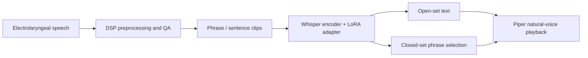

<div align="center">

# Electrolaryngeal Speech Recognition

Patient-adapted speech recognition for post-laryngectomy / electrolaryngeal speech.

[](#live-demo)
[](#method)
[](#live-demo)
[](#privacy)

Teaching machines to understand electrolaryngeal speech, where off-the-shelf ASR often fails and patient-adapted models recover usable text.

Demo link available on request.

</div>

## Highlights

| Result | What It Means |
|---|---|
| **110% -> 25% WER** on the public demo samples | Curated authorized Dave examples comparing zero-shot Whisper with the adapted model. The demo includes honest misses, not only perfect rows. |
| **13.7% open-set WER** on a held-out Dave phrase run | Latest local held-out evaluation from the sentence/phrase ASR track. Metrics vary by session and split. |
| **0.0% closed-set WER / 100% sentence accuracy** on the same held-out run | Menu-style phrase selection is currently the most product-ready path. |
| **CPU-first deployment path** | Public demo is a static Hugging Face Space; local live inference runs the adapted ASR and cached / optional Piper voice playback. |

## Live Demo

An authorized static demo is maintained separately from the public source tree.

The demo uses a small authorized subset of Dave's electrolaryngeal recordings. Each row compares:

1. the original electrolaryngeal audio,
2. off-the-shelf Whisper output,
3. the patient-adapted Whisper + LoRA output,
4. cached Piper/Ryan natural-voice playback generated from the adapted text.

Example rows:

| Ground Truth | Zero-Shot Whisper | Adapted Model |
|---|---|---|
| `how often` | `i love it` | `how often` |
| `i cannot wait to` | `i can always do it` | `i cannot wait to` |
| `the more the more` | `some more some more` | `the more the more` |
| `compared to` | `i'm better too` | `compared two` |

The public page is intentionally static so it is free, fast, and safe to keep online. Raw private training data is not included.

## Method



The project started as a signal-processing pipeline and evolved into a patient-adapted ASR system:

- **DSP front end:** 16 kHz mono conversion, DC removal, high-pass filtering, active-speech RMS normalization, adaptive VAD, clip-level QA.
- **ASR adaptation:** Whisper + LoRA fine-tuning on patient phrase/sentence recordings.
- **Closed-set decoding:** when the use case allows a menu of phrases, the system selects the most likely phrase instead of unconstrained transcription.
- **Voice output:** recognized text can be rendered with a natural TTS voice for communication demos.

## Why This Is Hard

Electrolaryngeal speech is not just "noisy speech." The acoustic source is different from normal voicing, and consonant cues such as B/P, D/T, and G/K can be weak, shifted, or missing. A generic ASR model trained mostly on normal speech can confidently produce fluent but wrong text.

This repository therefore treats the problem as an engineering pipeline:

```text
raw recording
-> conservative DSP normalization
-> phrase / word / sentence annotation
-> patient-adapted recognition
-> closed-set fallback where appropriate
-> natural voice playback
```

## Repository Map

| Path | Purpose |
|---|---|
| `hf_static_space_demo/` | Source for the public Hugging Face static demo, including the small authorized sample subset and cached outputs. |
| `tools/audio_auto_process.py` | Current recommended DSP preprocessing path for B/P word-list recordings. |
| `tools/inspect_audio_signal.py` | First-pass audio inspection: duration, RMS, peak, clipping, DC offset, VAD statistics, waveform, spectrogram. |
| `tools/evaluate_bp_session_shift_fixes.py` | Session-shift experiments for B/P consonant detection. |
| `src/speech_pipeline/` | Reusable DSP, audio IO, filtering, normalization, segmentation, and feature utilities. |
| `docs/roadmap.md` | Layered roadmap from raw data governance to DSP, segmentation, neural assist, and ML baselines. |
| `docs/project_log.md` | Technical experiment log and major decisions. |
| `tools/old_method/` | Archived earlier experiments kept for reproducibility and learning history. |

Some ASR training and annotation scripts are still being organized from local experiments before being treated as a stable public API.

## Quick Start

### 1. Inspect a new WAV recording

```powershell
python tools\inspect_audio_signal.py `
  --input "data\raw\example.wav" `
  --outdir "experiments\step1_audio_inspection"
```

### 2. Run the current B/P word-list preprocessing path

```powershell
python tools\audio_auto_process.py `
  --input "data\raw\input.wav" `
  --speaker speaker_id `
  --overwrite
```

This exports normalized word clips and a manifest for later feature extraction and model evaluation.

### 3. Preview the public demo locally

```powershell
cd hf_static_space_demo
python -m http.server 8788
```

Then open:

```text
http://127.0.0.1:8788
```

## Engineering Notes

- The project uses explicit QA metrics before model training because recording level, onset alignment, and session drift can dominate model choice.
- Earlier B/P word-level classifiers looked strong within a single session but degraded across sessions, which led to per-session normalization, calibration experiments, and the shift toward sentence-level ASR.
- Closed-set phrase recognition is currently the most robust product path when the target communication set is known.
- Open-set ASR remains an active research path that needs more multi-day, multi-style patient recordings.

## Privacy

Raw recordings are intentionally excluded from version control. Speech data can contain personal, clinical, or identifying information. This repository should contain code, documentation, reproducible experiment descriptions, anonymized plots, and only explicitly authorized public demo samples.

## Roadmap

- Add a clean public ASR training/evaluation release around the Whisper + LoRA and closed-set phrase workflow.
- Expand patient-adapted evaluation across more days and speaking styles.
- Add a lightweight annotation workflow for phrase-level labels.
- Improve robustness to session shift through normalization, calibration, and data coverage.
- Package a CPU-friendly local demo for recruiters and technical reviewers.
